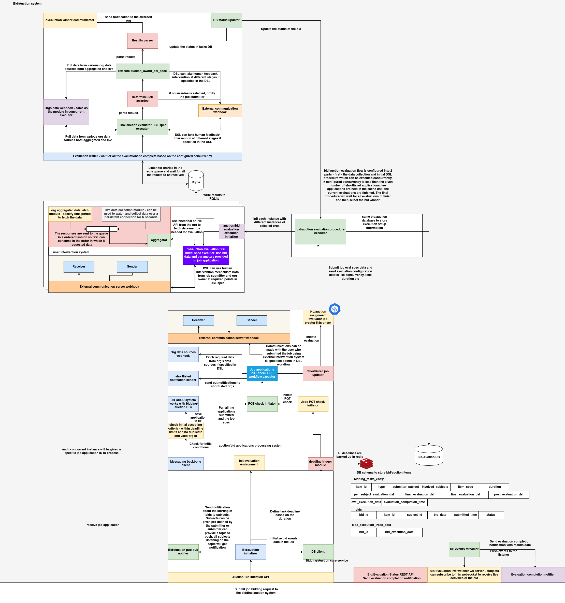

# Bidding and Evaluation System

The Bidding and Evaluation System provides a database and a set of services for managing the complete lifecycle of bidding tasks. It supports the creation and storage of bidding tasks, notification of participants, bid submission through APIs, bid storage, evaluation of bids, and result notifications.

This system is fully customizable, DSLs to define bidding workflows. Bidding tasks can be defined using custom DSLs, enabling tailored evaluation logic and winner selection criteria. As a result, the system is highly flexible and can be adapted to support any type of bidding process.

**Use Cases**:

1. Agents can leverage the Bidding and Evaluation System to initiate bidding tasks that require participation from multiple agents.

2. Tasks can be assigned to specific participants through a competitive bidding mechanism.

3. Enables collaborative bidding for shared resources.

4. Can operate as a standalone system for executing highly customized bidding workflows.

---

# Architecture

The **Bidding and Evaluation System** is a distributed, asynchronous, and DSL-configurable framework for managing complex bidding workflows, including pre-qualification checks, evaluation, human intervention, result publishing, and multi-agent communication. It supports both automated and human-in-the-loop decision-making, integrates with external services, and is designed for high concurrency and modular extensibility.



## 1. Overview

The system architecture is centered around a **bid auction pipeline**. It begins with agents submitting job applications, which then traverse through pre-defined processing stages—each configurable via DSLs—culminating in bid evaluation, winner determination, and multi-party notifications. The architecture supports:

* Custom validation and selection logic through DSLs
* Real-time event streaming over NATS
* Structured data collection for auditing and analytics
* External communication and webhook support
* Modular subcomponents for human intervention and evaluation orchestration

---

## 2. System Modules and Flow

### 2.1 Auction Task Initialization

* **Initiation API**: Receives job application and auction creation requests. Each job is assigned a unique evaluation group ID and instance.
* **Metadata Resolver**: Fetches associated org data, configurations, and subject metadata needed for processing.
* **DB CRUD System**: Pulls application details, prequalification rules, and related DSL configurations.

> **Key Activities**:
>
> * Validation of payload
> * Authorization check
> * Persistence in the Auction DB

---

### 2.2 Pre-Qualification Check (PQT)

* **PQT DSL Executor**: Runs the DSL defined for pre-qualification. The logic may reject invalid applications before evaluation begins.
* **Job Filtering**: Invalid or unauthorized bids are discarded, and valid ones proceed to the evaluation queue.

---

### 2.3 Bid Aggregation and Evaluation Setup

* **Evaluation Orchestrator**: Groups valid applications by evaluation group ID.
* **Evaluation Trigger**: DSL-driven trigger that initiates evaluation once all required conditions are met (e.g., time, number of bids).
* **Evaluation Queue**: Batches of bids are submitted to the evaluation pipeline, optionally with human approval.

---

### 2.4 Bid Evaluation Pipeline

* **Evaluation Worker**: Waits until concurrency or batch criteria are met. Supports asynchronous multi-evaluator execution.
* **Evaluation DSL Executor**: Invokes task-specific DSL for ranking, scoring, or winner selection.
* **Post-Evaluation DSL (Optional)**: Additional logic such as audit trails, multi-pass evaluations, or human verification.
* **Result Composer**: Compiles winners, scoring metadata, and other DSL outputs.

---

### 2.5 Result Recording and Notification

* **Result Persister**: Writes evaluation outcomes to `BidTaskResults` collection.
* **NATS Notification Dispatcher**: Publishes `bidding_winner` event to:

  * All selected winners
  * Bidding task initiator
* **Event Payload** includes task ID, winners, evaluation result data, and triggering subject.

---

### 2.6 External Communication Support

* **Webhook Publisher**: Can push result and status updates to external systems (e.g., partner servers, monitoring endpoints).
* **Human Intervention Hooks**: Supports sending evaluation summaries to receivers for approval or inspection before finalizing results.
* **Receiver/Sender Framework**: Modular endpoints to connect with external communication layers, including custom notification protocols.

---

## 3. DSL Integration

All critical phases (PQT, Evaluation, Post-Evaluation) are defined by dynamically loaded **Domain-Specific Languages**. These DSLs allow for:

* **Custom eligibility checks** before bidding
* **Flexible scoring mechanisms** for bid evaluation
* **Special logic for tie-breakers**, multi-winner selection, or disqualification
* **Chained execution**, allowing Post-Evaluation to refine results

DSLs are stored, versioned, and linked to bidding tasks via IDs passed at task creation time.

---

## 4. Internal and External Communication

| Channel                      | Purpose                                                                                                                   |
| ---------------------------- | ------------------------------------------------------------------------------------------------------------------------- |
| **NATS Topics**              | Used for internal notifications such as `bid_invite`, `bidding_winner`, etc. Each agent listens on `<subject_id>_events`. |
| **External Webhooks**        | Configurable webhooks can be registered to receive task results, errors, or summaries.                                    |
| **Human Decisioning System** | Allows pausing evaluation until a human review is completed. Results are then unblocked for final submission.             |

---

## 5. Database Models

Each core entity in the system corresponds to a persistent model:

* **BidTasksDB**: Stores bidding task metadata, DSL config, involved subjects, etc.
* **Bid**: Stores user-submitted bid proposals with timestamps and bid data.
* **BidTaskResults**: Stores final outcome of evaluations, including winner list and evaluation metadata.

All models support querying and filtering via REST or internal background jobs.

---

## 6. Evaluation Execution and Concurrency

Evaluation is not monolithic. The system allows multiple **evaluation workers** to operate in parallel across different task groups. Concurrency is managed through:

* Evaluation group assignments
* Worker pool sizing
* Awaiting of all concurrent results before result publication
* Background threads or job queues used for async result submission

---

## 7. Resilience and Fault Tolerance

* **All event dispatches** are retried on failure using exponential backoff.
* **Missing or delayed DSL results** trigger fallback alerts or human inspection.
* **Bid and result objects** are versioned and auditable.
* **Each module** has isolated responsibilities to reduce blast radius.

---

## Schema

Schema of bidding tasks:

```python

@dataclass
class BidTasksDB:
    bid_task_id: str = field(default_factory=lambda: str(uuid.uuid4()))
    bid_task_data: Dict = field(default_factory=dict)
    bid_task_eval_dsl_id: str = ""
    bid_task_pqt_check_dsl_id: str = ""
    bid_task_post_evaluation_id: str = ""
    bid_task_type: str = ""
    bid_task_creator_subject: str = ""
    bid_task_expiry_time: int = field(
        default_factory=lambda: int(time.time()) + 86400)
    bid_task_initiator_subject_id: str = ""
    bid_involved_subjects: List[str] = field(default_factory=list)
```

Here is a detailed explanation of each field in the `BidTasksDB` schema:

| Field Name                      | Type        | Description                                                                                                                                                           |
| ------------------------------- | ----------- | --------------------------------------------------------------------------------------------------------------------------------------------------------------------- |
| `bid_task_id`                   | `str`       | A unique identifier for the bidding task, automatically generated using `uuid4`.                                                                                      |
| `bid_task_data`                 | `Dict`      | Arbitrary input data or metadata associated with the bidding task. This may include contextual details, configuration parameters, or payloads required for execution. |
| `bid_task_eval_dsl_id`          | `str`       | Identifier for the evaluation DSL (Domain-Specific Language) that defines how bids are evaluated to select a winner.                                                  |
| `bid_task_pqt_check_dsl_id`     | `str`       | Identifier for the pre-qualification check DSL, used to filter or validate subjects before allowing them to participate in the bidding process.                       |
| `bid_task_post_evaluation_id`   | `str`       | Optional identifier for a post-evaluation handler or process, possibly used for notifications, logging, or executing further logic after winner selection.            |
| `bid_task_type`                 | `str`       | A string representing the type or category of the bidding task (e.g., resource allocation, task assignment, etc.).                                                    |
| `bid_task_creator_subject`      | `str`       | The subject (agent or user) who created the bidding task.                                                                                                             |
| `bid_task_expiry_time`          | `int`       | A UNIX timestamp (in seconds) indicating when the bidding task will expire. Defaults to 24 hours from creation.                                                       |
| `bid_task_initiator_subject_id` | `str`       | The ID of the subject who initiated the bidding process (could be different from the creator).                                                                        |
| `bid_involved_subjects`         | `List[str]` | A list of subject IDs that are eligible or expected to participate in the bidding process.                                                                            |


## Bid task creation APIs

### `POST /bid-tasks`

**Description**: Create a new bidding task with a customizable evaluation and participant configuration.

**Request Body**: JSON object with the following fields:

| Field                           | Type               | Required | Description                                    |
| ------------------------------- | ------------------ | -------- | ---------------------------------------------- |
| `bid_task_data`                 | `object`           | Yes      | Metadata or configuration for the bidding task |
| `bid_task_type`                 | `string`           | Yes      | Type or category of the bidding task           |
| `bid_task_creator_subject`      | `string`           | Yes      | Subject ID of the task creator                 |
| `bid_task_expiry_time`          | `integer`          | Yes      | Expiry time in UNIX timestamp                  |
| `bid_task_initiator_subject_id` | `string`           | Yes      | ID of the subject initiating the bidding       |
| `bid_task_eval_dsl_id`          | `string`           | No       | DSL ID for evaluation logic                    |
| `bid_task_pqt_check_dsl_id`     | `string`           | No       | DSL ID for pre-qualification checks            |
| `bid_task_post_evaluation_id`   | `string`           | No       | ID for post-evaluation handler                 |
| `bid_involved_subjects`         | `array of strings` | No       | List of subjects invited to bid                |

**Response**:

```json
{
  "success": true,
  "data": {
    "bid_task_id": "generated-uuid",
    ...
  }
}
```

**Curl Example**:

```bash
curl -X POST http://localhost:3000/bid-tasks \
  -H "Content-Type: application/json" \
  -d '{
    "bid_task_data": { "description": "Resource allocation" },
    "bid_task_type": "resource-bid",
    "bid_task_creator_subject": "agent-123",
    "bid_task_expiry_time": 1715683200,
    "bid_task_initiator_subject_id": "agent-456",
    "bid_task_eval_dsl_id": "dsl-eval-001",
    "bid_task_pqt_check_dsl_id": "dsl-pqt-002",
    "bid_task_post_evaluation_id": "post-eval-003",
    "bid_involved_subjects": ["agent-789", "agent-101"]
  }'
```

---

### `GET /bid-tasks/:bid_task_id`

**Description**: Retrieve details of a specific bidding task using its unique ID.

**Path Parameter**:

* `bid_task_id`: ID of the bidding task to fetch.

**Response**:

```json
{
  "success": true,
  "data": {
    "bid_task_id": "abc-123",
    ...
  }
}
```

**Curl Example**:

```bash
curl http://localhost:3000/bid-tasks/abc-123
```

---

### `PUT /bid-tasks/:bid_task_id`

**Description**: Update an existing bidding task using the provided fields.

**Path Parameter**:

* `bid_task_id`: ID of the bidding task to update.

**Request Body**: JSON object with fields to be updated.

**Response**:

```json
{
  "success": true,
  "data": "Bid task updated successfully"
}
```

**Curl Example**:

```bash
curl -X PUT http://localhost:3000/bid-tasks/abc-123 \
  -H "Content-Type: application/json" \
  -d '{ "bid_task_type": "priority-bid" }'
```

---

### `DELETE /bid-tasks/:bid_task_id`

**Description**: Delete a bidding task by its ID.

**Path Parameter**:

* `bid_task_id`: ID of the bidding task to delete.

**Response**:

```json
{
  "success": true,
  "data": "Bid task deleted successfully"
}
```

**Curl Example**:

```bash
curl -X DELETE http://localhost:3000/bid-tasks/abc-123
```

---

### `GET /bid-tasks`

**Description**: List all bidding tasks in the system.

**Response**:

```json
{
  "success": true,
  "data": [
    { "bid_task_id": "abc-123", ... },
    { "bid_task_id": "def-456", ... }
  ]
}
```

**Curl Example**:

```bash
curl http://localhost:3000/bid-tasks
```

---

### `POST /bid-tasks/query`

**Description**: Query the bidding tasks database using custom filters.

**Request Body**:

```json
{
  "query": { "bid_task_type": "resource-bid" }
}
```

**Response**:

```json
{
  "success": true,
  "data": [
    { "bid_task_id": "abc-123", ... }
  ]
}
```

**Curl Example**:

```bash
curl -X POST http://localhost:3000/bid-tasks/query \
  -H "Content-Type: application/json" \
  -d '{ "query": { "bid_task_type": "resource-bid" } }'
```

---

### How Bid Creation Works Internally

The `/bid-tasks` endpoint internally invokes `create_bidding_task(bid_task_data)`, which performs the following steps:

1. **Validation**: Checks required and optional fields for type correctness and presence.
2. **Instance Creation**: Creates a `BidTasksDB` object with the input data.
3. **Persistence**: Stores the object using `BidTaskRegistryDB.create_bid_task`.
4. **Event Notification**: If creation succeeds, sends a `bid_invite` event to all subjects in `bid_involved_subjects` plus the initiator, using the `EventsPusher` (NATS).
5. **Asynchronous Execution**: Notification is dispatched in the background via `run_async_background`.
6. **Response**: Returns the full task record on success, or error info on failure.

---


### Event Notifications via NATS (for Bid Creation)

The `EventsPusher` class is responsible for sending event notifications over [NATS](https://nats.io), a lightweight, high-performance messaging system used in the Bidding and Evaluation System.

#### Event Publisher: `EventsPusher`

When a bidding task is created via `POST /bid-tasks`, the system does the following:

* Constructs a notification payload with the event type `bid_invite`
* Publishes the message to each participant's topic: `<subject_id>_events`

**Example Notification Payload**:

```json
{
  "event_type": "bid_invite",
  "sender_subject_id": "agent-123",
  "event_data": {
    "bid_task_id": "abc-123",
    "bid_task_type": "resource-bid",
    ...
  }
}
```

**Topic Format**:

```
<subject_id>_events
```

---

### How to Subscribe to Bid Events

Any agent or external service that wants to listen for bid creation events must subscribe to their respective NATS topic using a compatible NATS client.

Here’s a sample Python subscriber using `asyncio` and `nats-py`:

#### Python Subscriber Example

```python
import asyncio
from nats.aio.client import Client as NATS

async def run():
    nc = NATS()

    await nc.connect("nats://localhost:4222")  # Use the same NATS URL

    async def message_handler(msg):
        subject = msg.subject
        data = msg.data.decode()
        print(f"Received on [{subject}]: {data}")

    # Example: Subscribe to agent-456's event topic
    await nc.subscribe("agent-456_events", cb=message_handler)

    print("Listening for bid events...")

    # Keep the subscriber running
    while True:
        await asyncio.sleep(1)

if __name__ == "__main__":
    asyncio.run(run())
```

---

### Notes

* Each agent should subscribe to `<their_subject_id>_events`.
* The subscriber receives all messages pushed by `EventsPusher` in real time.
* Events can include `bid_invite`, `bid_result`, or any future event types.
* Event payloads are serialized using `str(message).encode('utf-8')`. You may want to use `json.dumps()` for consistency and `json.loads()` on the subscriber side for parsing.

---

## Bids Submission system

The `Bid` class represents a single bid submitted by a subject (agent/user) in response to a bidding task. Each instance of this class holds all relevant information related to a specific bid.

Here is the schema for storing bids:

```python
@dataclass
class Bid:
    bid_id: str = field(default_factory=lambda: str(uuid.uuid4()))
    bid_task_id: str = ""
    creation_time: int = field(default_factory=lambda: int(time.time()))
    bid_data: Dict = field(default_factory=dict)
    bid_subject_id: str = ""
```


| Field Name       | Type   | Description                                                                                                                                                    |
| ---------------- | ------ | -------------------------------------------------------------------------------------------------------------------------------------------------------------- |
| `bid_id`         | `str`  | A unique identifier for the bid. Automatically generated using `uuid.uuid4()`.                                                                                 |
| `bid_task_id`    | `str`  | The ID of the bidding task to which this bid belongs. This forms a link between the bid and the parent bidding task.                                           |
| `creation_time`  | `int`  | UNIX timestamp representing when the bid was created. Defaults to the current time at the moment of submission.                                                |
| `bid_data`       | `Dict` | Arbitrary data submitted as part of the bid. This can include proposed values, pricing, capabilities, or any relevant attributes required by the bidding task. |
| `bid_subject_id` | `str`  | The ID of the subject (agent or participant) who submitted this bid. Used to track ownership and for notification/evaluation logic.                            |

---

## Bids APIs:

### `POST /bids`

**Description**: Submit a new bid for an active bidding task. Validates PQT, participation rights, and bid duplication.

**Request Body**: JSON object with the following fields:

| Field            | Type     | Required | Description                                               |
| ---------------- | -------- | -------- | --------------------------------------------------------- |
| `bid_task_id`    | `string` | Yes      | ID of the bidding task the bid is associated with         |
| `bid_subject_id` | `string` | Yes      | ID of the subject submitting the bid                      |
| `bid_data`       | `object` | Yes      | Bid payload (proposal details, pricing, parameters, etc.) |

**Response**:

```json
{
  "success": true,
  "data": {
    "bid_id": "generated-uuid",
    ...
  }
}
```

**Curl Example**:

```bash
curl -X POST http://localhost:3000/bids \
  -H "Content-Type: application/json" \
  -d '{
    "bid_task_id": "task-001",
    "bid_subject_id": "agent-123",
    "bid_data": { "proposed_value": 500 }
  }'
```

---

### `POST /bid-tasks/:bid_task_id/check-pqt`

**Description**: Run the pre-qualification test (PQT) DSL for a specific bid task to determine if a subject is allowed to submit a bid.

**Path Parameter**:

* `bid_task_id`: The bidding task for which PQT should be evaluated.

**Request Body**:

```json
{
  "bid_task_id": "task-001",
  "bid_subject_id": "agent-123",
  "bid_data": { "criteria": "some-value" }
}
```

**Response**:

```json
{
  "success": true,
  "data": {
    "allowed": true
  }
}
```

**Curl Example**:

```bash
curl -X POST http://localhost:3000/bid-tasks/task-001/check-pqt \
  -H "Content-Type: application/json" \
  -d '{
    "bid_task_id": "task-001",
    "bid_subject_id": "agent-123",
    "bid_data": { "criteria": "some-value" }
  }'
```

---

### `GET /bids/:bid_id`

**Description**: Retrieve the details of a submitted bid by its ID.

**Path Parameter**:

* `bid_id`: ID of the bid.

**Response**:

```json
{
  "success": true,
  "data": {
    "bid_id": "bid-001",
    "bid_task_id": "task-001",
    ...
  }
}
```

**Curl Example**:

```bash
curl http://localhost:3000/bids/bid-001
```

---

### `PUT /bids/:bid_id`

**Description**: Update an existing bid by its ID with new bid data.

**Path Parameter**:

* `bid_id`: ID of the bid to update.

**Request Body**: JSON object containing fields to update (e.g. `bid_data`).

**Response**:

```json
{
  "success": true,
  "data": "Bid updated successfully"
}
```

**Curl Example**:

```bash
curl -X PUT http://localhost:3000/bids/bid-001 \
  -H "Content-Type: application/json" \
  -d '{ "bid_data": { "proposed_value": 600 } }'
```

---

### `DELETE /bids/:bid_id`

**Description**: Delete a submitted bid by its ID.

**Path Parameter**:

* `bid_id`: ID of the bid to delete.

**Response**:

```json
{
  "success": true,
  "data": "Bid deleted successfully"
}
```

**Curl Example**:

```bash
curl -X DELETE http://localhost:3000/bids/bid-001
```

---

### `GET /bids`

**Description**: List all bids in the system.

**Response**:

```json
{
  "success": true,
  "data": [
    { "bid_id": "bid-001", ... },
    { "bid_id": "bid-002", ... }
  ]
}
```

**Curl Example**:

```bash
curl http://localhost:3000/bids
```

---

### `POST /bids/query`

**Description**: Query bids using Mongo-style filters.

**Request Body**:

```json
{
  "query": { "bid_task_id": "task-001" }
}
```

**Response**:

```json
{
  "success": true,
  "data": [
    { "bid_id": "bid-001", ... }
  ]
}
```

**Curl Example**:

```bash
curl -X POST http://localhost:3000/bids/query \
  -H "Content-Type: application/json" \
  -d '{ "query": { "bid_task_id": "task-001" } }'
```

---

### How Bid Submission Works Internally

The `submit_bid(bid_data)` function performs the following steps:

1. **Validation**: Ensures required fields are present: `bid_task_id`, `bid_subject_id`, `bid_data`.
2. **Bid Task Retrieval**: Fetches the referenced bidding task using `bid_task_id`.
3. **Expiry Check**: Verifies the bidding task is still active.
4. **Duplicate Check**: Ensures the subject hasn’t already submitted a bid for this task.
5. **Authorization Check**: Confirms the subject is listed in `bid_involved_subjects`.
6. **PQT Check** *(if configured)*:

   * Runs a DSL-based PQT using the `check_pqt(...)` function.
   * If DSL fails or does not return `allowed: true`, the bid is rejected.
7. **Bid Insertion**: Creates and stores the `Bid` object in the database.
8. **Response**: Returns bid metadata on success or an error message otherwise.

---

## Bidding results

The `BidTaskResults` data model stores the result of a completed bidding task, including the winning participants, evaluated output, and associated metadata. It serves as a formal record of the bidding task’s outcome.

Here is the schema of Bid tasks results:

| Field Name           | Type        | Description                                                                                                     |
| -------------------- | ----------- | --------------------------------------------------------------------------------------------------------------- |
| `result_id`          | `str`       | Unique identifier for the result entry. Automatically generated using `uuid.uuid4()`.                           |
| `bid_task_id`        | `str`       | The ID of the bidding task this result belongs to. Links the result to its originating task.                    |
| `bid_task_data`      | `Dict`      | Original metadata of the bid task (copied for context or auditing).                                             |
| `winner_subject_ids` | `List[str]` | List of subject IDs who were declared winners of the bidding task.                                              |
| `eval_result_data`   | `Dict`      | The output of the evaluation process, possibly generated by a DSL. Includes scoring, ranking, or justification. |
| `initiated_by`       | `str`       | Subject ID of the agent or system that initiated the evaluation or finalized the result.                        |
| `bid_task_type`      | `str`       | Type/category of the bid task, useful for filtering and analytics.                                              |
| `created_at`         | `int`       | UNIX timestamp indicating when the result was created. Automatically set to current time.                       |

---

This schema is typically created after executing a bid evaluation DSL and selecting one or more winners. It allows for later retrieval, audits, and notifications to participants.

## Bidding results APIs

### `GET /bid-task-results/:result_id`

**Description**: Retrieve the result of a specific bidding task using its result ID.

**Path Parameter**:

* `result_id`: ID of the result to fetch.

**Response**:

```json
{
  "success": true,
  "data": {
    "result_id": "result-123",
    "bid_task_id": "task-456",
    ...
  }
}
```

**Curl Example**:

```bash
curl http://localhost:3000/bid-task-results/result-123
```

---

### `GET /bid-task-results`

**Description**: Query the results collection for all or filtered bidding task outcomes.

**Request Body** (optional): MongoDB-style filter query (use with `curl --data` as GET+body is non-standard)

```json
{
  "bid_task_type": "resource-bid"
}
```

**Response**:

```json
{
  "success": true,
  "data": [
    { "result_id": "result-123", ... },
    { "result_id": "result-456", ... }
  ]
}
```

**Curl Example**:

```bash
curl -X GET http://localhost:3000/bid-task-results \
  -H "Content-Type: application/json" \
  --data '{ "bid_task_type": "resource-bid" }'
```

---

### `PUT /bid-task-results/:result_id`

**Description**: Update a result entry with new fields or corrections.

**Path Parameter**:

* `result_id`: ID of the result to update.

**Request Body**: JSON with fields to update (e.g. `winner_subject_ids`, `eval_result_data`, etc.)

**Response**:

```json
{
  "success": true,
  "message": "Result updated"
}
```

**Curl Example**:

```bash
curl -X PUT http://localhost:3000/bid-task-results/result-123 \
  -H "Content-Type: application/json" \
  -d '{ "winner_subject_ids": ["agent-456", "agent-789"] }'
```

---

### `DELETE /bid-task-results/:result_id`

**Description**: Delete a result entry by its ID.

**Path Parameter**:

* `result_id`: ID of the result to delete.

**Response**:

```json
{
  "success": true,
  "message": "Result deleted"
}
```

**Curl Example**:

```bash
curl -X DELETE http://localhost:3000/bid-task-results/result-123
```

---

### `POST /bid-task/:bid_task_id/start-evaluation`

**Description**: Initiate the evaluation of a specific bid task. This process runs in the background.

**Path Parameter**:

* `bid_task_id`: ID of the bid task to evaluate.

**Response**:

```json
{
  "success": true,
  "message": "Evaluation for BidTask task-456 has started in the background."
}
```

**Curl Example**:

```bash
curl -X POST http://localhost:3000/bid-task/task-456/start-evaluation
```

---

Here is a complete, high-level explanation of the **bidding evaluation flow**, the **structure of the winner notification**, and how agents can **subscribe to these notifications using Python**.

---

### Bidding Task Evaluation Flow

The `BidsEvaluator` class is responsible for evaluating all bids submitted to a bidding task, determining the winner(s), recording the result, and notifying relevant subjects. This process is automated and uses customizable DSL workflows to evaluate bids in a flexible and task-specific manner.

#### 1. Fetch Bid Task and Bids

The evaluator fetches the bidding task details and the list of bids submitted for that task. If either is missing or invalid, the evaluation is halted.

#### 2. Execute Evaluation DSL

The system runs a DSL (Domain-Specific Language) workflow defined by the `bid_task_eval_dsl_id`. The DSL receives:

* The bidding task metadata
* The list of bids submitted

The DSL logic evaluates the bids according to predefined rules and selects one or more winners.

#### 3. Optional Post-Evaluation DSL

If a post-evaluation workflow (`bid_task_post_evaluation_id`) is specified, the system runs an additional DSL after the initial evaluation. This can be used to validate or refine the results.

#### 4. Record Evaluation Result

The result of the evaluation is stored as an entry in the `BidTaskResults` database. This includes:

* The list of winning subject IDs
* Evaluation metadata (scoring, justification, etc.)
* The associated bidding task ID and metadata

#### 5. Notify Participants

Once the result is stored, the system prepares a structured event and publishes it via NATS messaging to:

* All winners
* The initiator of the bidding task

Each recipient receives the notification on their respective topic, which follows the pattern:

```
<subject_id>_events
```

---

### Structure of the Notification Message

The event sent to each recipient is a dictionary serialized to a UTF-8 encoded string. The structure is as follows:

```json
{
  "event_type": "bidding_winner",
  "sender_subject_id": "initiator-123",
  "event_data": {
    "bid_task_id": "task-001",
    "bid_task_data": { ... },
    "winner_subject_ids": ["agent-456", "agent-789"],
    "eval_result_data": { ... }, 
    "initiated_by": "initiator-123",
    "bid_task_type": "resource-bid"
  }
}
```

---

### How to Listen to Bidding Notifications in Python

Participants (agents) can subscribe to their NATS topic to receive real-time bid result notifications. Here is a basic subscriber implementation using `nats-py`.

#### Python Subscriber Example

```python
import asyncio
from nats.aio.client import Client as NATS
import json

async def run():
    nc = NATS()

    # Connect to NATS server
    await nc.connect("nats://localhost:4222")

    # Replace with your actual subject ID
    subject_id = "agent-456"
    topic = f"{subject_id}_events"

    async def message_handler(msg):
        try:
            data = msg.data.decode()
            event = json.loads(data)
            print(f"Received event on {msg.subject}: {json.dumps(event, indent=2)}")

            if event.get("event_type") == "bidding_winner":
                winners = event["event_data"].get("winner_subject_ids", [])
                if subject_id in winners:
                    print("You are a winner of the bid!")
        except Exception as e:
            print(f"Error parsing event: {e}")

    # Subscribe to the subject-specific topic
    await nc.subscribe(topic, cb=message_handler)
    print(f"Subscribed to topic: {topic}")

    # Keep running
    while True:
        await asyncio.sleep(1)

if __name__ == "__main__":
    asyncio.run(run())
```

---

### Summary

* The bidding system evaluates submitted bids using customizable DSLs.
* Evaluation results are saved to a dedicated result store.
* Winners and initiators are notified through structured NATS events.
* Each agent can listen for `bidding_winner` events on their `<subject_id>_events` topic.

