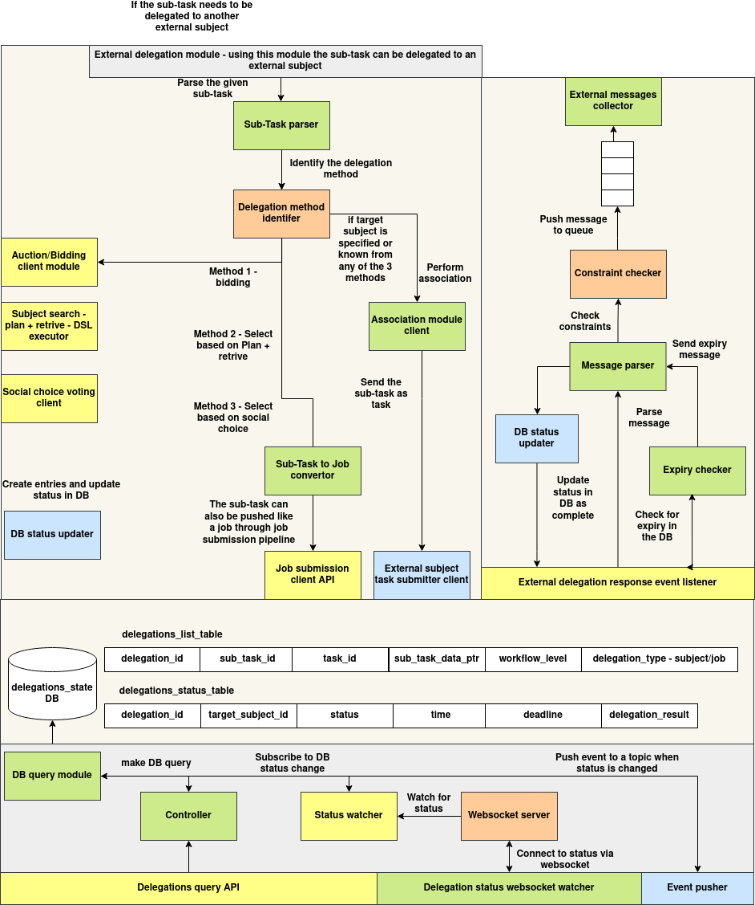

# Agents Task Delegation

## Architecture



The **Agents Task Delegation** system follows a modular, event-driven design for delegating sub-tasks across agents in a distributed environment. It features a structured flow for identifying target agents, submitting tasks, updating state, and broadcasting results in real-time. The architecture is divided into three major subsystems: **Delegation Pipeline**, **External Response Handler**, and **State Synchronization Layer**.

### 1. Delegation Pipeline

The pipeline initiates when a task is determined to be delegated to an external subject. It flows through the **External Delegation Module**, which handles parsing and delegation logic:

* **Sub-Task Parser** extracts metadata and routing logic from the incoming sub-task.
* The **Delegation Method Identifier** selects the delegation strategy:

  * **Auction/Bidding Client Module** for competitive agent selection
  * **DSL-based Plan + Retrieve Module** to programmatically assign an agent
  * **Social Choice Voting Client** to determine assignment via voting
* Once a target subject is selected or known, the **Association Module Client** establishes agent linkage and delegates the sub-task.

Depending on the delegation type:

* Tasks may be dispatched directly via the **External Subject Task Submitter Client**, or
* Converted to a job submission via the **Sub-Task to Job Converter** and routed through the **Job Submission Client API**.

All assignments and status entries are persisted through the **DB Status Updater**.

---

### 2. External Response Handler

This component processes messages from delegated agents once a task is completed:

* Incoming responses are queued by the **External Messages Collector**.
* The **Constraint Checker** validates message compliance.
* The **Message Parser** extracts key fields for DB updates.
* The **Expiry Checker** evaluates whether the task exceeded its deadline.
* Valid messages lead to updates through the **DB Status Updater**, marking the task as complete.

This ensures robust tracking and automated cleanup of expired or invalid delegations.

---

### 3. State Synchronization Layer

Delegation records are stored in the **Delegations State DB**, primarily across:

* `delegations_list_table`: stores metadata about delegated sub-tasks
* `delegations_status_table`: tracks live status, deadlines, and results

State changes are actively monitored:

* The **Status Watcher** observes DB-level updates.
* The **WebSocket Server** enables real-time client notifications on status changes.
* Updates are published through the **Event Pusher**, allowing downstream services or user interfaces to react promptly.

The **Controller** and **DB Query Module** support query-based inspection and filtering via the **Delegation Query API**.

---

## Delegation Tasks Database

### Introduction

This system manages agent-to-agent task delegation. It allows agents to assign sub-tasks to other agents through a structured and monitored process, backed by MongoDB for persistence and NATS for event-driven communication.

Delegation entries record metadata, sub-task details, status transitions, and enable real-time event notification through a messaging bus.

---

### Schema

#### `DelegationStatus`

```python
@dataclass
class DelegationStatus:
    state: str = ""
    time: int = field(default_factory=lambda: int(time.time()))
    deadline: Optional[int] = None
    delegation_result: Optional[str] = None
```

| Field               | Type   | Description                                                  |
| ------------------- | ------ | ------------------------------------------------------------ |
| `state`             | `str`  | Current state (e.g., `"pending"`, `"in_progress"`, `"done"`) |
| `time`              | `int`  | Timestamp (in seconds) when status was recorded              |
| `deadline`          | `int?` | Optional deadline timestamp                                  |
| `delegation_result` | `str?` | Optional result or output of the delegated task              |

---

#### `Delegation`

```python
@dataclass
class Delegation:
    delegation_id: str = field(default_factory=lambda: str(uuid.uuid4()))
    task_id: str = ""
    sub_task_id: str = ""
    workflow_level: int = 0
    delegation_type: str = ""
    target_subject_id: str = ""
    sender_subject_id: str = ""
    status: Dict[str, DelegationStatus] = field(default_factory=dict)
    sub_task_data: Dict = field(default_factory=dict)
```

| Field               | Type                          | Description                                            |
| ------------------- | ----------------------------- | ------------------------------------------------------ |
| `delegation_id`     | `str`                         | Unique identifier for the delegation                   |
| `task_id`           | `str`                         | Parent task identifier                                 |
| `sub_task_id`       | `str`                         | Sub-task identifier                                    |
| `workflow_level`    | `int`                         | Workflow stage at which this delegation is occurring   |
| `delegation_type`   | `str`                         | Type of delegation (e.g. `"manual"`, `"system"`)       |
| `target_subject_id` | `str`                         | Agent receiving the task                               |
| `sender_subject_id` | `str`                         | Agent assigning the task                               |
| `status`            | `Dict[str, DelegationStatus]` | Statuses keyed by stage name                           |
| `sub_task_data`     | `Dict`                        | Any additional metadata needed to execute the sub-task |

---

### APIs

All routes are prefixed with `/delegations`.

---

#### `GET /delegations/<delegation_id>`

Fetch a delegation by ID.

**Response:**

```json
{
  "success": true,
  "data": { ...delegation... }
}
```

---

#### `POST /delegations`

Create a new delegation.

**Payload:**

```json
{
  "task_id": "task123",
  "sub_task_id": "sub456",
  "workflow_level": 1,
  "delegation_type": "manual",
  "target_subject_id": "agentB",
  "sender_subject_id": "agentA",
  "sub_task_data": { "key": "value" }
}
```

**Response:**

```json
{
  "success": true,
  "message": "Delegation created successfully"
}
```

---

#### `PUT /delegations/<delegation_id>`

Update delegation fields.

**Payload:** JSON of fields to update.

**Response:**

```json
{
  "success": true,
  "message": "Delegation updated successfully"
}
```

---

#### `DELETE /delegations/<delegation_id>`

Delete a delegation.

**Response:**

```json
{
  "success": true,
  "message": "Delegation deleted successfully"
}
```

---

#### `POST /delegations/query`

Query delegations with Mongo-style filters.

**Payload Example:**

```json
{
  "target_subject_id": "agentB"
}
```

**Response:**

```json
{
  "success": true,
  "data": [ { ...delegation1... }, { ...delegation2... } ]
}
```

---

#### `PUT /delegations/<delegation_id>/status/<status_key>`

Update status for a specific workflow stage.

**Payload:**

```json
{
  "state": "in_progress",
  "time": 1717390000,
  "deadline": 1717400000
}
```

**Response:**

```json
{
  "success": true,
  "message": "Delegation status updated successfully"
}
```

---

#### `PUT /delegations/submit_result/<delegation_id>`

Shortcut API to submit final delegation result.

**Payload:**

```json
{
  "state": "done",
  "delegation_result": "Execution completed successfully"
}
```

Updates the `delegation_result` key in the status map.

**Response:**

```json
{
  "success": true,
  "message": "Delegation status updated successfully"
}
```

---

### Communication

This system uses NATS for real-time delegation communication.

#### Event Types

| Event Type          | Sent On                         |
| ------------------- | ------------------------------- |
| `delegation_task`   | When a new task is created      |
| `delegation_result` | When a task result is submitted |

#### Message Format

```json
{
  "event_type": "delegation_task",
  "event_data": {
    "task_id": "task123",
    "sub_task_id": "sub456",
    "delegation_id": "del789",
    "data": { "param": "value" }
  },
  "sender_subject_id": "agentA"
}
```

#### Python Example: Sending an Event

```python
from delegation_tasks_pusher import NATSAPI

nats = NATSAPI(nats_url="nats://localhost:4222")
nats.push_event(
    topic="agentB",
    sender_subject_id="agentA",
    event_type="delegation_task",
    event_data={
        "task_id": "task123",
        "sub_task_id": "sub456",
        "delegation_id": "del789",
        "data": {"info": "Execute this subtask"}
    }
)
```

#### Python Example: Listening to Events

```python
import asyncio
import json
from nats.aio.client import Client as NATS

async def on_message(msg):
    data = json.loads(msg.data.decode())
    print(f"Received: {data}")

async def main():
    nc = NATS()
    await nc.connect("nats://localhost:4222")
    await nc.subscribe("agentB", cb=on_message)
    await asyncio.sleep(100)

asyncio.run(main())
```

This pattern allows the agent receiving the task (`agentB`) to act on the delegation and optionally respond using `delegation_result`.

---

