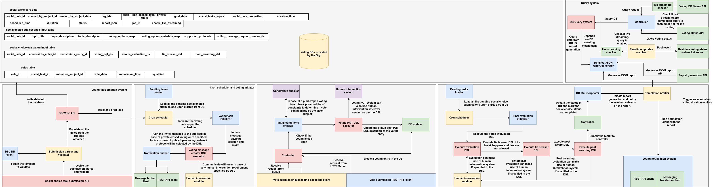

## Introduction

The **Social Choice Voting System** is a modular and extensible backend framework designed to orchestrate, evaluate, and manage social choice-based voting workflows. It enables the submission, validation, and evaluation of structured votes associated with collaborative decision-making tasks, where voting rules and evaluation logic are defined dynamically via domain-specific DSLs (Domain-Specific Languages).

The system is designed for flexibility, allowing organizations or agents to configure:

* Access control (public vs. private voting)
* Voting specifications and metadata
* Voting pre-qualification rules
* Choice evaluation and tie-breaking logic
* Post-awarding workflows and notification mechanisms

### Core Capabilities

* **Task Lifecycle Management**: Create, store, and manage social choice tasks.
* **Vote Submission**: Accept votes via REST API or NATS messaging system.
* **DSL-Driven Evaluation**: Use configurable DSL workflows to compute winners, handle tie-breaking, and run post-award logic.
* **Reporting and Auditing**: Automatically generate and persist a comprehensive voting report after task completion.
* **Live Streaming Interface**: Provide real-time task state updates via a WebSocket interface.
* **Query API**: Enable consumers and dashboards to fetch task results, metadata, and live task bundles on demand.

### Architecture Components

* **REST API Server**: Supports structured queries and task metadata access.
* **WebSocket Server**: Streams task state updates if live streaming is enabled.
* **Vote Acceptor**: Handles validation, PQT DSL checks, and DB storage of votes.
* **DSL Evaluator**: Executes evaluation DSLs to determine voting results.
* **Kubernetes Evaluation Job**: Triggered after vote threshold is met; executes DSLs and generates final outcomes.
* **Post-Processing Layer**: Generates reports, stores final results, and notifies winners via NATS.

This system is designed to integrate seamlessly into larger decision-making and agent-driven systems, providing robust task orchestration, traceability, and pluggable evaluation logic.

---

## Architecture Overview

The Social Choice Voting System is designed as a modular, event-driven backend framework that handles the complete lifecycle of structured voting tasks. The system is composed of multiple coordinated subsystems that manage task creation, vote intake, validation, DSL-based evaluation, result publication, and query access.

The architecture is divided into the following logical domains:



### 1. **Task Creation and Initialization**

* **Submission Parser and Validator**: Parses a high-level task definition into structured components: core task data, voting specification, and evaluation inputs.
* **DB Write API**: Writes all validated components into MongoDB collections.
* **Scheduler Registration**: Registers the task with a cron scheduler for timed initiation.
* **DSL DB Client**: Provides schema templates to validate incoming specifications if needed.

---

### 2. **Vote Intake and Pre-Qualification**

* **Vote Submission REST API / NATS Listener**: Accepts votes either via HTTP or messaging.
* **Initial Conditions Checker**: Ensures task is active, vote is not duplicated, and access rules are met.
* **Voting PQT DSL Executor**: Executes pre-qualification DSL logic to accept or reject a vote.
* **DB Updater**: Writes qualified or disqualified votes to the `votes` collection and updates status.
* **Human Intervention System** (optional): Triggered when DSL specifies interactive validation logic.

---

### 3. **Voting Task Initiation**

* **Cron Scheduler**: Polls the DB to find scheduled tasks and moves them into an active state.
* **Voting Task Initializer**: Triggers task activation and initiates voting message generation.
* **Voting Message DSL Executor**: Executes the DSL responsible for constructing NATS voting invite payloads.
* **Notification Pusher**: Publishes invite messages to voter-specific NATS subjects.

---

### 4. **Evaluation and Post-Awarding**

* **Final Evaluation Initializer**: Launched once all required votes are submitted (private) or threshold met (public).
* **DSL Executor Sequence**:

  * **Choice Evaluation DSL**: Computes the winner(s)
  * **Tie Breaker DSL** (if needed): Resolves multiple top votes
  * **Post-Award DSL**: Constructs final result metadata and actions
* **DB Status Updater**: Marks the task as `"complete"` and stores the full report JSON.
* **Completion Notifier**: Pushes result messages via NATS or triggers external systems.

---

### 5. **Query and Live Monitoring Subsystem**

* **Query API Controller**: Exposes task status, report access, and filtered data queries over REST.
* **Live Streaming Checker**: Determines if a task supports real-time streaming.
* **WebSocket Server**: Periodically streams full task bundles to authorized clients.
* **Detailed JSON Report Generator**: Packages complete task, vote, and DSL evaluation outputs as a report.

---

### 6. **Storage and Messaging Backend**

* **Voting DB (MongoDB)**: Stores all structured entities including tasks, specs, evaluation logic, and votes.
* **NATS Server**: Handles message-based interactions including voting invites and result notifications.
* **Kubernetes Cluster**: Executes the votes evaluation job in an isolated job container.

---

### Integration and Modularity

The system is fully extensible via DSL workflows and cleanly separated service layers. It supports pluggable:

* Evaluation logic
* Message brokers
* Task types
* Result dissemination protocols

---

## Schema

The voting system uses the following core data structures to model tasks, voting options, evaluation logic, and individual votes. Each structure is represented as a Python `@dataclass`, stored in MongoDB, and used throughout the submission and evaluation workflow.

---

### 1. `SocialTaskCoreData`

```python
@dataclass
class SocialTaskCoreData:
    social_task_id: str
    created_by_subject_id: str
    created_by_subject_data: Dict
    org_ids: List[str]
    social_task_access_type: str  # private / public
    goal_data: Dict
    social_tasks_topics: List[str]
    social_task_properties: Dict
    creation_time: datetime
    scheduled_time: Optional[datetime] = None
    duration: Optional[int] = None
    status: Optional[str] = None
    report_json: Optional[Dict] = field(default_factory=dict)
    job_id: Optional[str] = None
    enable_live_streaming: Optional[bool] = False
```

| Field                     | Type     | Description                                                  |
| ------------------------- | -------- | ------------------------------------------------------------ |
| `social_task_id`          | str      | Unique identifier for the voting task                        |
| `created_by_subject_id`   | str      | ID of the subject who created the task                       |
| `created_by_subject_data` | dict     | Metadata about the creator (name, profile, etc.)             |
| `org_ids`                 | list     | List of subject IDs allowed to vote (if task is private)     |
| `social_task_access_type` | str      | `"private"` or `"public"` access type                        |
| `goal_data`               | dict     | Describes the objective or goal of the task                  |
| `social_tasks_topics`     | list     | Topics or tags associated with the task                      |
| `social_task_properties`  | dict     | Additional properties (urgency, category, etc.)              |
| `creation_time`           | datetime | Time the task was created                                    |
| `scheduled_time`          | datetime | Time the voting is scheduled to start                        |
| `duration`                | int      | Duration or threshold (used for vote counts in public tasks) |
| `status`                  | str      | Current status: `scheduled`, `started`, `complete`           |
| `report_json`             | dict     | Final report generated after evaluation                      |
| `job_id`                  | str      | Kubernetes job ID for evaluation                             |
| `enable_live_streaming`   | bool     | Whether live WebSocket updates are allowed                   |

---

### 2. `SocialChoiceSubjectSpecInput`

```python
@dataclass
class SocialChoiceSubjectSpecInput:
    social_task_id: str
    topic_title: str
    topic_description: str
    voting_options_map: Dict
    voting_option_metadata_map: Dict
    supported_protocols: List[str]
    voting_message_request_creator_dsl: str
```

| Field                                | Type | Description                                                         |
| ------------------------------------ | ---- | ------------------------------------------------------------------- |
| `social_task_id`                     | str  | ID of the task this spec belongs to                                 |
| `topic_title`                        | str  | Title shown to voters                                               |
| `topic_description`                  | str  | Description of what is being voted on                               |
| `voting_options_map`                 | dict | Maps option IDs (e.g., `"A"`) to labels (e.g., `"Solar Energy"`)    |
| `voting_option_metadata_map`         | dict | Additional metadata per voting option                               |
| `supported_protocols`                | list | Communication protocols (e.g., `http`, `ipfs`) supported for voting |
| `voting_message_request_creator_dsl` | str  | DSL workflow ID used to generate voting invite messages             |

---

### 3. `SocialChoiceEvaluationInput`

```python
@dataclass
class SocialChoiceEvaluationInput:
    social_task_id: str
    constraints_entry_id: str
    constraints_entry_id_1: str
    voting_pqt_dsl: str
    choice_evaluation_dsl: str
    tie_breaker_dsl: str
    post_awarding_dsl: str
```

| Field                    | Type | Description                                                                 |
| ------------------------ | ---- | --------------------------------------------------------------------------- |
| `social_task_id`         | str  | ID of the task being evaluated                                              |
| `constraints_entry_id`   | str  | Reference to constraint rules (optional use)                                |
| `constraints_entry_id_1` | str  | Secondary constraint reference (optional use)                               |
| `voting_pqt_dsl`         | str  | DSL ID used to determine if a vote qualifies before submission              |
| `choice_evaluation_dsl`  | str  | DSL ID that computes the winner or list of tied winners                     |
| `tie_breaker_dsl`        | str  | DSL ID to resolve ties, used if multiple winners are returned               |
| `post_awarding_dsl`      | str  | DSL ID that performs post-winner logic (notifications, state changes, etc.) |

---

### 4. `Votes`

```python
@dataclass
class Votes:
    vote_id: str
    social_task_id: str
    submitter_subject_id: str
    vote_data: Dict
    submission_time: datetime
    qualified: bool
```

| Field                  | Type     | Description                                                     |
| ---------------------- | -------- | --------------------------------------------------------------- |
| `vote_id`              | str      | Unique identifier of the vote                                   |
| `social_task_id`       | str      | ID of the task this vote belongs to                             |
| `submitter_subject_id` | str      | Subject who submitted the vote                                  |
| `vote_data`            | dict     | Raw vote content (e.g., chosen option)                          |
| `submission_time`      | datetime | Timestamp of when the vote was received                         |
| `qualified`            | bool     | Whether the vote passed the PQT DSL and is valid for evaluation |

---


## REST API Documentation

The system exposes several REST endpoints for:

* Task submission
* Vote submission
* Task querying and report retrieval
* Ad hoc parsing for validation

---

### 1. `POST /internal/process-task`

**Description**: Submits a new social voting task by parsing the input and storing structured data in the database.

#### Request Body (JSON)

```json
{
  "core_data": {
    "created_by_subject_id": "subject_123",
    "created_by_subject_data": { "name": "Alice" },
    "org_ids": ["org1", "org2"],
    "social_task_access_type": "private",
    "goal_data": { "objective": "Select best renewable strategy" },
    "social_tasks_topics": ["environment", "energy"],
    "social_task_properties": { "urgency": "high" },
    "scheduled_time": "2025-06-12T15:00:00",
    "duration": 3,
    "enable_live_streaming": true
  },
  "subject_spec": {
    "topic_title": "Energy Policy Choice",
    "topic_description": "Choose between wind, solar, and hydro energy options",
    "voting_options_map": { "A": "Wind", "B": "Solar", "C": "Hydro" },
    "voting_option_metadata_map": {},
    "supported_protocols": ["http"],
    "voting_message_request_creator_dsl": "invite_dsl_1"
  },
  "evaluation_spec": {
    "voting_pqt_dsl": "pqt_qualifier_v1",
    "choice_evaluation_dsl": "evaluate_v1",
    "tie_breaker_dsl": "resolve_ties",
    "post_awarding_dsl": "notify_winners"
  }
}
```

#### Response

```json
{
  "social_task_id": "task_xyz123"
}
```

---

### 2. `POST /internal/adhoc-parse`

**Description**: Parses and validates task input format without committing to the database.

#### Request Body

Same format as `/internal/process-task`.

#### Response

```json
{
  "core_data": { ...parsed SocialTaskCoreData... },
  "subject_spec": { ...parsed SocialChoiceSubjectSpecInput... },
  "evaluation_spec": { ...parsed SocialChoiceEvaluationInput... }
}
```

---

### 3. `POST /submit-vote`

**Description**: Submits a vote and validates it using PQT DSL.

#### Request Body

```json
{
  "vote_id": "vote_789",
  "social_task_id": "task_xyz123",
  "submitter_subject_id": "subject_456",
  "vote_data": { "selected_option": "B" }
}
```

#### Response (Success)

```json
{
  "message": "Vote recorded",
  "qualified": true
}
```

#### Response (Failure)

```json
{
  "error": "Subject has already voted"
}
```

---

### 4. `GET /get-report/<social_task_id>`

**Description**: Returns the final report JSON for a given task.

#### Response

```json
{
  "social_task_id": "task_xyz123",
  "report_json": { ... }
}
```

---

### 5. `POST /generic-query/<collection_name>`

**Description**: Performs a filtered query on any collection.

#### Request Body

```json
{
  "social_task_id": "task_xyz123"
}
```

#### Response

```json
[
  { ... },
  { ... }
]
```

---

### 6. `GET /get-status/<social_task_id>`

**Description**: Returns the current status of the voting task.

#### Response

```json
{
  "status": "started"
}
```

---

### 7. `GET /get-full-task-bundle/<social_task_id>`

**Description**: Returns the entire task context including specs and all votes.

#### Response

```json
{
  "core_data": { ... },
  "subject_spec": { ... },
  "evaluation_spec": { ... },
  "votes": [ ... ]
}
```

---

### 8. `GET /is-live-streaming-enabled/<social_task_id>`

**Description**: Checks if the task supports WebSocket-based live streaming.

#### Response

```json
{
  "enabled": true
}
```

---

## WebSocket API Documentation

The WebSocket server provides **real-time streaming** of voting task data, primarily useful for dashboards or observers who wish to monitor voting task progress as it evolves.

### Endpoint

```
ws://<host>:8765/live-stream
```

---

### 1. Connection Initialization

The client must send a JSON message immediately after connecting to initiate streaming.

#### Request Message Format

```json
{
  "social_task_id": "task_xyz123",
  "refresh_interval_sec": 5
}
```

| Field                  | Type   | Description                                  |
| ---------------------- | ------ | -------------------------------------------- |
| `social_task_id`       | string | The task ID whose state is to be streamed    |
| `refresh_interval_sec` | int    | Polling interval in seconds (e.g., 2, 5, 10) |

---

### 2. Server Behavior

Upon receiving a valid request:

* The server **checks if live streaming is enabled** for the given `social_task_id`.
* If **enabled**, the server:

  * Spawns a background thread for the connection.
  * Periodically calls `get_full_task_bundle(social_task_id)` from the `QueriesManager`.
  * Sends the current snapshot of task state to the client over WebSocket.
* If **not enabled**, the server sends an error response and terminates the connection.

---

### 3. Streaming Payload Format

The server sends task bundle snapshots as JSON, every `refresh_interval_sec` seconds:

```json
{
  "type": "task_update",
  "data": {
    "core_data": { ... },
    "subject_spec": { ... },
    "evaluation_spec": { ... },
    "votes": [ ... ]
  }
}
```

---

### 4. Error Response Format

If the task does not support streaming, or the request is malformed:

```json
{
  "type": "error",
  "message": "Live streaming is not enabled for this task"
}
```

---

### 5. Termination Handling

* The background thread is automatically **terminated** when the client disconnects.
* If an internal error occurs (e.g., DB failure), the connection is closed with an error message.

---

### Example Usage (Client-Side)

```python
import asyncio
import websockets
import json

async def consume():
    uri = "ws://localhost:8765/live-stream"
    async with websockets.connect(uri) as websocket:
        await websocket.send(json.dumps({
            "social_task_id": "task_xyz123",
            "refresh_interval_sec": 5
        }))

        while True:
            response = await websocket.recv()
            print("Update received:", response)

asyncio.run(consume())
```

---

## Event Subscription via NATS

The system uses **NATS** (a lightweight, high-performance messaging system) to send events such as:

* **Voting invitations** sent to eligible subjects when a task starts
* **Winner announcements** after evaluation is complete

External systems, bots, or agents can subscribe to these messages to perform automated actions or display updates.

---

### NATS Configuration

* The NATS server URL is expected to be available via the environment variable: `ORG_NATS_URL`
* Topics are published per-subject using their `subject_id` as the NATS topic name

---

### Event Message Format

Each event is a JSON object with the following structure:

```json
{
  "event_type": "voting_invite" | "winner_announcement",
  "sender_subject_id": "subject_123",
  "event_data": {
    "voting_info": { ... },
    "dsl_output": { ... } // Present if applicable
  }
}
```

| Field               | Description                                                |
| ------------------- | ---------------------------------------------------------- |
| `event_type`        | Type of event: `voting_invite` or `winner_announcement`    |
| `sender_subject_id` | Subject who initiated the event (usually the task creator) |
| `event_data`        | DSL-generated output and context metadata                  |

---

## Subscribing to NATS Topics (Python Example)

You can use the `asyncio-nats-client` library to subscribe to messages.

### Installation

```bash
pip install nats-py
```

### Example: Subscriber Script

```python
import asyncio
import json
from nats.aio.client import Client as NATS

ORG_NATS_URL = "nats://localhost:4222"
SUBJECT_ID = "subject_456"  # Replace with your ID to subscribe

async def message_handler(msg):
    data = json.loads(msg.data.decode())
    print(f"Received event on [{msg.subject}]:")
    print(json.dumps(data, indent=2))

async def main():
    nc = NATS()
    await nc.connect(ORG_NATS_URL)

    await nc.subscribe(SUBJECT_ID, cb=message_handler)

    print(f"Subscribed to NATS subject '{SUBJECT_ID}'")
    while True:
        await asyncio.sleep(1)

if __name__ == '__main__':
    asyncio.run(main())
```

---

### Use-Cases for Subscribers

* **Agents**: Can initiate their workflows based on invitations.
* **Dashboards**: Display real-time status of task invitations and winners.
* **Auditing Systems**: Log voting lifecycle events for analysis or compliance.

---

## DSL Execution Flow

The voting system supports dynamic decision logic using pluggable **DSL (Domain-Specific Language) workflows**, executed using the `dsl_executor` module. These DSLs define the rules for:

* **Generating voting invitations**
* **Pre-qualifying votes (PQT)**
* **Evaluating the winning choice**
* **Resolving ties**
* **Running post-awarding logic**

### DSL Infrastructure

All DSL workflows are registered in a **Workflow Registry** and are executed via the `new_dsl_workflow_executor` interface.

### DSL Runner API

```python
from dsl_executor import new_dsl_workflow_executor, parse_dsl_output
```

---

### Step-by-Step DSL Execution

#### 1. **Voting Invitation Generation DSL**

**When it runs**: Before voting starts
**Where**: `VotingTaskInitiator`
**Workflow ID**: `voting_message_request_creator_dsl`
**Purpose**: Constructs the voting invitation message to be sent via NATS.

##### Input:

```python
{
    "core_data": ...,
    "subject_spec": ...,
    "evaluation_spec": ...,
    "addons": {
        "initiator_subject_id": <subject_id>
    }
}
```

##### Output:

DSL-defined voting message → used in the `"event_data"` field of `voting_invite` event.

---

#### 2. **Voting PQT (Pre-Qualification Test) DSL**

**When it runs**: On vote submission
**Where**: `VoteAcceptor`
**Workflow ID**: `voting_pqt_dsl`
**Purpose**: Validates a vote before accepting it.

##### Input:

```python
{
    "core_data": ...,
    "subject_spec": ...,
    "evaluation_spec": ...,
    "vote": <submitted_vote_dict>
}
```

##### Output:

Boolean or structured value used to set `qualified = true/false` in DB.

---

#### 3. **Choice Evaluation DSL**

**When it runs**: After all votes are collected
**Where**: `DSLEvaluator.evaluate()`
**Workflow ID**: `choice_evaluation_dsl`
**Purpose**: Determines the winner(s).

##### Input:

```python
{
    "core_data": ...,
    "subject_spec": ...,
    "evaluation_spec": ...,
    "votes": [ ...qualified votes... ]
}
```

##### Output:

* Single subject ID or
* List of subject IDs (in case of tie)

---

#### 4. **Tie Breaker DSL**

**When it runs**: Only if `choice_evaluation_dsl` returns multiple winners
**Where**: `DSLEvaluator.evaluate()`
**Workflow ID**: `tie_breaker_dsl`
**Purpose**: Resolves tie and selects final winner(s)

##### Input:

Same as choice evaluation, with added `winners` list.

##### Output:

Final winner(s) list.

---

#### 5. **Post-Awarding DSL**

**When it runs**: After final winner(s) determined
**Where**: `DSLEvaluator.evaluate()`
**Workflow ID**: `post_awarding_dsl`
**Purpose**: Triggers downstream logic (e.g., assignment, notifications)

##### Input:

```python
{
    "core_data": ...,
    "subject_spec": ...,
    "evaluation_spec": ...,
    "votes": [ ... ],
    "winners": [ ... ]
}
```

##### Output:

Custom payload used for:

* NATS winner announcements
* Audit trail
* Post-processing

---

### Output Structure

The `evaluate()` method of `DSLEvaluator` returns:

```python
{
    "winners": [...],
    "post_award_payload": {...},
    "dsl_outputs": {
        "choice_evaluation_output": {...},
        "tie_breaker_output": {...},
        "post_awarding_output": {...}
    }
}
```

---

## Vote Submission Lifecycle

This section describes how a vote is submitted, validated, processed, and stored in the system.

### Step-by-Step Lifecycle

#### 1. **Vote Submission**

Votes can be submitted via:

* **REST API** (`POST /submit-vote`)
* **NATS Topic** (topic = `subject_id`)

Each vote submission includes:

```json
{
  "vote_id": "vote_123",
  "social_task_id": "task_xyz123",
  "submitter_subject_id": "subject_456",
  "vote_data": {
    "selected_option": "A"
  }
}
```

---

#### 2. **Initial Validation** (`VotingInitialChecker`)

The vote is checked against the following conditions:

| Check                        | Condition                                         |
| ---------------------------- | ------------------------------------------------- |
| **Repeat submission**        | Submitter must not have voted on this task before |
| **Access control (private)** | Submitter must be in the task's allowed org list  |
| **Task status**              | Task must be in `"started"` state                 |

If any check fails, the system rejects the vote with an appropriate error message.

---

#### 3. **PQT DSL Execution** (`VoteAcceptor`)

If validation passes, the system executes the `voting_pqt_dsl`.

Input includes the vote and all 3 data-classes (core, subject spec, evaluation spec).
If PQT returns `true`, the vote is saved with `qualified = true`; else, `qualified = false`.

---

#### 4. **Database Write**

Vote is inserted into the `votes` collection, e.g.:

```json
{
  "vote_id": "vote_123",
  "social_task_id": "task_xyz123",
  "submitter_subject_id": "subject_456",
  "vote_data": { "selected_option": "A" },
  "submission_time": "2025-06-11T12:00:00",
  "qualified": true
}
```

---

#### 5. **Trigger Evaluation Check**

After storing the vote, the system invokes `VotingEvaluationInitiator` to check if evaluation conditions are met.

---

## Evaluation Job Execution Flow

This section outlines how the system triggers and processes evaluation once voting is complete.

---

### Triggering Conditions

Triggered from `VotingEvaluationInitiator` under two conditions:

| Task Type | Trigger Condition                        |
| --------- | ---------------------------------------- |
| `private` | All expected voters have submitted votes |
| `public`  | Vote count reaches threshold `N`         |

---

### Job Launch: Kubernetes

A Kubernetes job is created dynamically using the Python `kubernetes` client.

#### Job Configuration

| Setting         | Value                                         |
| --------------- | --------------------------------------------- |
| Namespace       | `votes-evalaution`                            |
| Job Name        | Equal to `social_task_id`                     |
| Container Image | `agentspacev1/votes-evaluator:v1`             |
| Env Variables   | `SOCIAL_TASK_ID`, `MONGO_URL`, `ORG_NATS_URL` |

The system ensures the namespace exists before launching the job.

---

### Job Logic: Evaluator Container

Inside the container, the following classes run sequentially:

#### 1. **Initiator**

Fetches from DB:

* `SocialTaskCoreData`
* `SocialChoiceSubjectSpecInput`
* `SocialChoiceEvaluationInput`
* All qualified votes

---

#### 2. **DSLEvaluator**

Executes in order:

* `choice_evaluation_dsl`
* (optional) `tie_breaker_dsl`
* `post_awarding_dsl`

Returns:

* `winners`
* `post_award_payload`
* Intermediate DSL outputs

---

#### 3. **PostProcessor**

* Builds final `report_json` including task data, votes, DSL results, and winners
* Saves report and updates task status to `"complete"` in DB

---

#### 4. **NotificationSender**

* Publishes NATS event of type `winner_announcement`
* Includes:

  * `winners`
  * `post_award_payload`
  * Full context metadata

---

## Report Structure

Once a voting task completes, a comprehensive **report JSON** is generated and stored in the `report_json` field of the corresponding `SocialTaskCoreData` entry. This report captures the full evaluation context and can be downloaded or streamed via APIs.

### Accessing the Report

* **REST API**: `GET /get-report/<social_task_id>`
* **WebSocket Streaming**: Returned in live updates (if enabled)

---

### Report JSON Format

```json
{
  "social_task_id": "task_xyz123",
  "core_data": { ... },
  "subject_spec": { ... },
  "evaluation_spec": { ... },
  "votes": [ ... ],
  "winners": [ "subject_456" ],
  "post_award_payload": { ... },
  "dsl_outputs": {
    "choice_evaluation_output": { ... },
    "tie_breaker_output": { ... },
    "post_awarding_output": { ... }
  }
}
```

---

### Field-by-Field Explanation

| Field                | Type     | Description                                                           |
| -------------------- | -------- | --------------------------------------------------------------------- |
| `social_task_id`     | `string` | The unique ID of the social voting task                               |
| `core_data`          | `object` | Full contents of `SocialTaskCoreData` as submitted                    |
| `subject_spec`       | `object` | Full contents of `SocialChoiceSubjectSpecInput`                       |
| `evaluation_spec`    | `object` | Full contents of `SocialChoiceEvaluationInput`                        |
| `votes`              | `list`   | List of all submitted and qualified vote records                      |
| `winners`            | `list`   | Final winner(s) selected post evaluation and (if needed) tie-breaking |
| `post_award_payload` | `object` | Output of `post_awarding_dsl`, typically used for notifications       |
| `dsl_outputs`        | `object` | Intermediate DSL outputs for transparency and debugging               |


---

### Notes

* All DSL outputs are optional but recommended for audit and transparency.
* The structure is fixed and designed to support machine readability for downstream systems.

